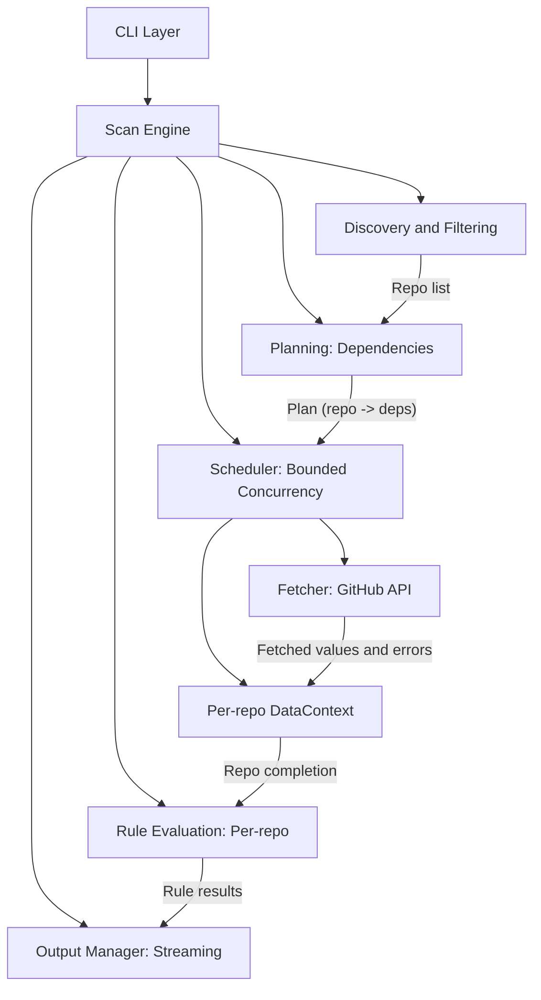

# RepoMedic Architecture

## Overview

RepoMedic is designed as a stateless, API-driven, fleet-scale wrong finder. It strictly separates the definition of "what to check" (Rules) from "how to get data" (Engine/Fetcher).

For the canonical agent/contributor playbook (contracts, extension checklists, and safe defaults), see `AGENTS.md`.

Related docs:
- `CONTRIBUTING.md`: contributor workflow and dev commands
- `.github/copilot-instructions.md`: Copilot-specific guidance (must remain tool-specific)

## Core Flow

## Components

### 1. Scan Engine
The central orchestrator. It runs the scan as a streaming pipeline:
1.  **Discovery & filtering**: Resolves `--org`, `--repos`, etc. to a list of repositories.
2.  **Planning**: Collects all dependencies from selected rules and builds a scan plan.
3.  **Streaming execution**: Executes the plan with bounded repo concurrency; each repo produces a `DataContext` (plus dependency errors) as soon as its fetches complete.
4.  **Evaluate-on-arrival**: Rules are evaluated immediately for each repo as its `DataContext` becomes available.
5.  **Streaming output**: Results and lifecycle events are emitted incrementally.

### 2. Dependency Fetcher & Request Budget
The **only** component allowed to talk to GitHub.
-   **RequestBudget**: Tracks rate limits and throttles requests to avoid secondary rate limits.
-   **Single-flight**: Ensures that if multiple rules need the same data (e.g., `repo.metadata`), it is fetched only once per repo.
-   **Caching**: In-memory cache for the duration of the scan.
-   **DataFetcher registry**: Fetch logic is implemented per dependency key in `internal/fetcher/fetch_*.go` files and registered via `init()`.

### 3. Rules
Rules are pure functions that take a `DataContext` and return a `Result`.
-   **Declarative**: Rules declare what data they need via `Dependencies()`.
-   **Isolated**: Rules cannot make network calls.
-   **Testable**: Rules are tested with mock `DataContext`.

### 4. DataContext
A read-only view of the data fetched for a specific repository. It abstracts the storage of fetched data.

## Data Flow

1.  **Rule Registration**: Rules register themselves and their dependencies.
2.  **Plan Generation**: The engine aggregates dependencies for all active rules.
3.  **Repo Execution (streamed)**: A scheduler runs repos with bounded concurrency and uses the fetcher to retrieve all required dependencies for a repo.
4.  **Context Creation**: For each repo, a `DataContext` is created with fetched values and associated dependency errors.
5.  **Evaluation + Output**: Rules evaluate the `DataContext` immediately and emit results incrementally.
